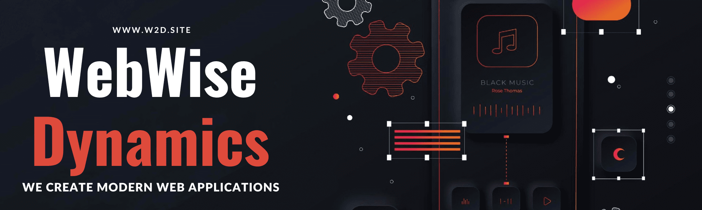

    <a href="https://w2d.site" target="_blank"></s>
        
    </a> 

### We specialize in the creation of innovative and avant -garde web solutions for companies of all sizes. Founded in the principles of creativity, efficiency and reliability, we commit ourselves to offer adapted high quality software to meet the unique needs and objectives of each client.

 

    
    
    
    
    
    
     
     
     
    
    
    

 

    <a href="https://www.linkedin.com/company/w2d-ar/" target="_blank"></s></a>

